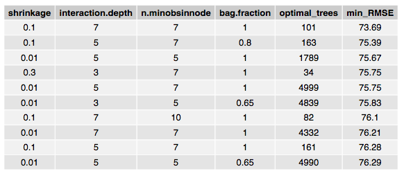

```{r include=FALSE}
library("knitr")
library("tidyverse")
library("magrittr")
library("stargazer")
```


\newpage


\setcounter{tocdepth}{2}
\tableofcontents


  
  
\newpage


# Introduction

## Context

In the context of the course "Machine Learning" at the University of Geneva,
we participated to the following data competition. The objective is to build a predictive model for a sandwich making restaurant called the "Sandwicheria" [@engelke_predicting_2019]. This restaurant has been operating for two years (700 days) and produces only one type of sandwich. The aim is to predict the total number of sold sandwiches for a given day using various predictors. The relevant statistic for the model performance is the root mean squared error, which is defined 
as follows:

$$
\text{Prediction error} = \sqrt{
  \frac{1}{m} \sum_{i = 1}^{m} (y_i - \hat{y_i})^2
}.
$$

In this formula, $y_i$ denotes the number of sandwiches sold in day $i$ and 
$\hat{y_i}$ the prediction for that day.

The restaurant collected data related to the number of sold sandwiches and on
other predictors for the 700 days of operation. The data were then randomly split in
two groups, one training set for model building and one test set for model
assessment. We are provided the complete training set as well as the 
predictors from the test data set. Our predictions are evaluated on approximately $1/3$ of the test set (public leaderboard score), and our final rank will depend on the other $2/3$ of the data (private leaderboard). Further instructions about the data 
competition can be found in @engelke_kaggle_2019.

In this final report, we present some baseline models as well as subset selection methods on the predictor set (Lasso, Genetic Algorithm), tree methods (Simple tree, Bagging, Random Forest and Boosting), kNN regression, PCA and a Semi-parametric model. 


## Mathematical notation

In this report, unless specified otherwise, we use the following convention: $y$ refers to the outcome variable (the number of sandwiches sold), and $y_i$ denotes the value of the outcome variable for one particular observation (day). Consequently, $i = 1, ..., n$ is used to index the observations. We use $x_j$ with $j = 1, ..., p$ to refer to the predictors. Logically, $x_{i j}$ is the value taken by the predictor $x_j$ for observation $i$. If we want to refer to a new observation, we use the subscript 0. Finally, when we write an "hat" over a letter, it refers to an estimate or prediction. For instance, $\hat{y}_i$ is an estimate of the value of the variable $y$ for observation $i$ using a certain model, such as the linear regression.


# Exploratory data analysis

The training data set [@engelke_training_2019] contains 350 entries on 
one response variable: the number of sandwiches sold for a given day (hereafter, y) 
as well as information about 111 covariates. We start by inspecting
the response variable y. Figure \ref{fig:desc_y} displays its most interesting
characteristics.

 

A quick inspection of the response y shows that, as expected, we don't
have seasonality. Further, the distribution of y is quite heavy tailed with respect to the Normal distribution (see QQ-plot).

The large number of predictors available renders exhaustive graphical
exploratory analysis or even summary statistics
quite time consuming and difficult to display. We therefore decide to use
scatter plots to try to detect some obvious dependence relationships. As we can see from
figure \ref{fig:y_x60_x62}, we found that variables X60 and X62 show some
linear dependence with y. However, a linear model with both
covariates shows non-significant coefficients.

{width=400px}

Further, we observe that some variables took only a few number of distinct
values. This lead us to think that some variables should be considered as 
categorical rather than as numerical.


# Data transformation

After this initial exploration, we decide to apply some transformations
to the data. Why? Firstly, because as stated in the previous section, we
consider that variables with a limited number of distinct values
should be treated as categorical and therefore transformed into factors. 
Secondly, knowing that we would need to use modelling tools which results
heavily depend on the scale of the variables (such as kNN), we need to 
standardize all of our variables.

In order to distinguish potential categorical variables from numerical ones,
we count the number of distinct values for each variables and represent
them using an histogram (figure \ref{fig:hist_ct_lev}). We observe that our variables
could be divided in two groups: one with less than 13 possible levels and
one with about more than 250. We thus decide to treat all the
variables with less than 13 values as categorical and 
transform them as factors.

{width=400px}

After this, we standardize the numerical variables using the build-in 
`scale()` function. After controlling our result, we apply the same
manipulations to the test data set.


# Modelling (before variable selection)

As a starting point, we decide to fit various basis models in order to
have a benchmark. Our aim is not to obtain a
very successful models immediately, but to assess the performance of 
well-known methods and to see to what extend the use of more 
sophisticated techniques could really improve the desired result.

In order to compare the performances of the tested models, we each time compute a so-called cross-validated RMSE (hereafter CV RMSE or CV-error). We split the training data set into 10 Folds, fit a model on each of these folds, compute the RMSE of each of these models and then average them. This gives us the CV RMSE. This provides us a standard evaluation metric based on the training data. Then, we use the scores obtained on the public leaderboard as an evaluation metric based on a sample of the test data.

## Linear models

### Full Linear Model

We thus start by fitting a simple linear regression model using all the predictors at our disposal as presented in equation \ref{eq:lm_all}:


\begin{align}
\label{eq:lm_all}
y_i = \beta_0 + \beta_1 x_{i 1} + ... + \beta_{111} x_{i 111} + \epsilon.
\end{align}

With this naive model, we obtained a public leaderboard score of 122.32 as well as a 10-Folds Cross-validation error of 120.73. The $R^2$ of the model is 0.939, which seems quite large a priori. However, as we will see in the next sections, this model probably suffers from over-fitting as many predictors may be irrelevant.

### Ridge Regression Model

Then, we run a ridge regression with the entire predictor set. Ridge regression is a penalized alternative to OLS, which aims to produce smaller coefficient estimates with the tuning parameter $\lambda$. These coefficients minimize equation \ref{eq:lm_ridge}:

\begin{align}
\label{eq:lm_ridge}
\text{Penalized RSS} = 
\sum_{i=1}^{n} (y_{i} - \beta_{0} - \sum_{j=1}^{p} \beta_{j}x_{ij})^{2} + \lambda \sum_{j=1}^{p} \beta_{j}^{2}.
\end{align}

In some cases when the number of predictors $p$ is very large, models using all $p$ features can over-fit the data. It is then useful to penalize large coefficients for each predictors using ridge regression (some features will have coefficients, or an "effect" which are squeezed to 0). For ridge regression, we obtained a CV RMSE of 82.67 with cross-validation (10 folds) using the one standard error rule (hereafter one-SE rule)[^oneSE], with an optimal $\lambda$ value of 95.73. The public leaderboard score is 100.26. Figure \ref{fig:ridge_1} shows how most ridge coefficients are estimated to be non-null and how the optimal $\lambda$ is selected to minimize the training RMSE.

[^oneSE]: This procedure first determines the optimal parameter values in terms of CV-error and then retains the smallest $\lambda$ possible associated with a CV-error still within one standard error of the lowest CV-error [@breiman_classification_1984].

### Lasso Regression Model

An alternative to ridge regression is the lasso. Instead of using the $L_{2}$ norm of the coefficients in the penalization equation, the lasso uses the $L_{1}$ norm and minimizes the following equation \ref{eq:lm_lasso}:

\begin{align}
\label{eq:lm_lasso}
\text{Penalized RSS} = 
\sum_{i=1}^{n} (y_{i} - \beta_{0} - \sum_{j=1}^{p} \beta_{j}x_{ij})^{2} + \lambda \sum_{j=1}^{p} \left| \beta_{j} \right|.
\end{align}

This has the effect of forcing some coefficients exactly to 0, effectively doing variable selection. By running a lasso regression, we obtain an average CV RMSE of 72.17 with cross-validation (10 folds) using the one-SE rule, with an optimal $\lambda$ value of 15.97. Figure \ref{fig:lasso_1} in contrast shows that certain coefficients are exactly set to 0 and how the optimal $\lambda$ only includes a small subset of the starting 111 variables in the model. The selected 8 lasso variables will be presented later in a summarizing table (section \ref{sec:results}). The public leaderboard score is 88.75, which is already a significant improvement on the ridge regression score. As this method selects a subset of the entire predictor set, we decide to further explore subset selection (section \ref{sec:selection}).

{width=400px}

{width=400px}

### Intercept-only model

Additionally, we fit an intercept-only model. In this setting, our prediction is simply the average of the outcome variable in the training set (we don't consider any of the predictors). This average is approximately equal to 447.61. Of course, our aim is not to obtain a very accurate prediction, but to have one more reference point for future model evaluation. On the training set, we obtain a RMSE of 197.36. On the test set we obtain a public leaderboard score of 199.83. This is consistent with the score of the SampleSubmission.csv entry on the public leaderboard. 

## kNN model

Continuing our process of reference model evaluation, we use the k-Nearest-Neighbours procedure. The core principle is to make a prediction of the outcome variable using the average of the values of a certain number k of "close points" (neighbours). In this setting, the relationship between our outcome variable y and the covariates x is specified as in equation \ref{eq:knn}:

\begin{align}
  \label{eq:knn}
  \widehat{y_0} = \frac{1}{k} \sum_{i : x_i \in N_k \left( x_0 \right)} y_{i}.
\end{align}

In this expression, $\widehat{y_0}$ is the predicted value of an observation vector $x_0$, k is the number of neighbours that we consider and $N_k(x)$ refers to the k points $x_i$ which are closest to the observation vector $x_0$. In our context, we define "closest points" as the points for which the $\ell_2$-norm of the vector $x_0 - x_i$ is the smallest [^note_scaling]. For categorical variables, the distance between $x_{0j} - x_{ij}$ is equal to zero if the categories are identical and equal to one otherwise.

[^note_scaling]: Remember that we standardized the variable to avoid exaggerate weight of the variables with wide scales.

We consider the whole 111 predictors and chose the parameter k using a 10-Folds Cross-Validation procedure along with the one-SE rule. As can be see in figure \ref{fig:knn_1}, we obtain $k^{*} = 22$. After fitting a kNN model on the whole data set and this parameter, we obtain a CV RMSE of 156.57 on the training set. The predictions obtain a public leaderboard score of 154.64 on the test set.

{width=400px}

## Tree-based models

### Single Regression Tree Model

We continue our modelling process by fitting a regression tree. The principle of regression trees is to split the predictor space into non-overlapping hyper-rectangles $R_j$. We do so by iteratively splitting the space and subsequently the hyper-rectangles into two distinct areas. At each split, we try to maximize the homogeneity of the hyper-rectangles in terms of outcome variable. We stop when a given criterion is met. 

The result of this procedure can be represented by a decision tree. Starting at the root, we follow the branches according to the values of the predictors and the criterion for each branch. When we reach a terminal node, we use the average of the outcome variable of each point located at this node. Our objective is to build a tree such that it minimizes the RSS as shown by equation \ref{eq:tree}:


\begin{align}
  \label{eq:tree}
  RSS = \sum_{j=1}^{J} \sum_{i : x_{i} \in R_{j}} 
  \left(y_{i} - \widehat{y}_{R_{j}} \right)^{2}.
\end{align}

In this equation, J denotes the total number of rectangles, $\widehat{y}_{R_{j}}$ the prediction in this rectangle and $y_i$ the actual value of the outcome variable for observation i.

In our case, we consider the space of all the predictors. We retain the maximal depth of any node as a stopping criterion. To determine it, we perform 10-Folds Cross-Validation on trees with values from 1 to 100. The result is displayed by figure \ref{fig:singletree_1}. It turns out that the CV-error does not decrease much after a maximal depth of about 12. Using the one standard error rule, we obtain an optimal parameter value of 6. After fitting a tree with this value, we obtain a 10-Folds Cross-validated RMSE of 103.60. The predictions of this model obtain a public leaderboard score of 92.25. We observe that the tree effectively uses 7 variables. The relatively low performance of this model may be due to the fact that the maximum depth may not be a fine-enough parameter for proper model regularization. The magnitude of the drop in CV-error between a maximal depth of 5 and of 6 also supports this interpretation. Thus, it could make sense to try again the procedure using either a maximal number of nodes or a complexity penalty criterion.

{width=400px}


### Bagged Model

Bagging is a method based on the bootstrap. This method repeatedly bootstraps $B$ samples of the same size as the training data set with replacement, fits a regression tree on each bootstrapped sample and averages all the predictions as in the following equation \ref{eq:bagging}:

\begin{align}
\label{eq:bagging}
\hat{f}_{bag}(x) = \frac{1}{B} \sum_{b=1}^{B} \hat{f}^{*b}(x).
\end{align}

Averaging the predictions of many models with low bias but high variance reduces the variance of the prediction but keeps a low bias. By bagging a linear regression model with the full predictor set ($B=1000$), we obtain a training RMSE of 49.52 and a public leaderboard score of 226.89. We did not implement CV to compute a test error as it would have been too time consuming (one CV procedure for each 1000 bootstrapped samples). However, we are aware that these results do not seem very coherent. We then tried bagging a regression tree with the following subset of predictors: X19, X34, X35, X59, X60, X75 and X104. (the 7 predictors obtained by CV from the previous regression tree). We obtain a training RMSE of 197.34 and a public leaderboard score of 215.89. 

We then try 10-Folds Cross-Validation to find an optimal $B$ parameter between 100 and 1000 using regression trees grown with the full predictor set. The following figure shows our results. 

{width=400px}

Although the minimal CV RMSE is obtained with $B=400$ bootstrap samples, we see that the variation in CV-error is not very drastic. This makes us believe that this parameter for bagging will not change our bagging results much. Thus we do not make any more predictions using the bagging method.

### Random Forest Model

Although bagging is a powerful method, the bootstrapped samples may be correlated. The Random Forest method decorrelates the predictions on each model by randomly selecting a fixed subset of variables $m < p$ to fit each model. Although m stays constant, the subset is randomly selected and the predictors are thus different for each sample. In our case, we selected $m = 37 \approx \frac{p}{3}$ variable subsets, which is typical for regression. 

We first submit a RF model with $m=37$ and 500 trees, and obtain a training RMSE of 91.39 and a public leaderboard score of 75.21 which were a significant improvement on our results.

We then submit 2 RF models based on optimal training RMSE finding  $m=60$ and $ntree=200$, and $m=105$ and $ntree=330$. We then compare both models with regard to their CV RMSE. These models respectively obtain CV RMSEs of 89.01 and 89.31 and public leaderboard scores of 83.10 and 83.77. We then conducted 10-Fold CV across the $m$ and $n$ tree parameters to try to get a better test error approximation. We did not have any time to submit more RF models but present the CV results in the following plots (figures \ref{fig:RF_CV_RMSE_m} and \ref{fig:RF_CV_RMSE_ntree}):

{width=400px}

{width=400px}

We see that optimal CV RMSEs are obtained with $m=70$ (keeping $ntree=500$) and with $ntree=550$ (while keeping $m=70$).

#### Random Forest Variable Importance 

A nice feature of the Random Forest is the variable importance. The following plots (figure \ref{fig:var_imp2}) shows by how much the MSE would increase if the variable was randomized and how much Node Purity increases. Node purity is a measure of how homogeneous a node is, and Node impurity is taken as the variance of a node in our regression case. The left plot focuses on the 8 predictors which seem to decrease the MSE the most, and the right plot focuses on the 8 predictors which increase Node Purity the most. Both measures are an indication of how useful the variable is to the model. In both plots, most influential variables are the same. We notice that only a small subset of variables significantly reduces the MSE (and therefore the RMSE)  and increases the purity. This confirms the idea that not all predictors are useful in predicting the response. We will use these features later on when we do modelling with a subset of variables.

{width=400px}


### Boosting

After trying Bagging and Random Forest methods, we decide to implement boosting to see if this method would increase our model's performance. To this goal, we implemented a \textit{Gradient Boosting Machine} using R's `gbm` package. Boosting tries to improve on the Simple tree method. It iteratively builds an ensemble of sequential non-deep trees which are trained on the error of the whole ensemble. Fitting small trees has the advantage of being computationally cheap and allows the algorithm to improve slowly on the errors which are minimized using Gradient Descent and the MSE loss function in our regression case. To be even more specific, we used Stochastic Gradient Descent (hereafter SGD) where a random fraction of the training data is selected to speed up computations and help avoiding local minima. As a result, boosted models are very accurate and can be tuned with different hyper-parameters by using 10-Folds Cross-Validation to avoid over-fitting. However, as we used grid search to select the best hyper-parameters, this procedure is quite time consuming.

The general idea behind boosting is illustrated in the following pseudo-code:

\begin{enumerate}
  \item Fit the first regression tree $F_{1}(x) = y$.
  \item Fit a new tree on the residuals $h_{1}(x)=y-F_{1}(x)$.
  \item Add the new tree to the algorithm: $F_{2}(x)=F_{1}(x)+h_{1}(x)$.
  \item Fit a new decision tree to the residuals of $F_{2}$: $h_{2}(x)=y-F_{2}(x)$.
  \item Continue until stopping criterion met.
\end{enumerate}

Generally speaking, we can consider boosted regression trees as a sequential additive model with $B$ trees of the form:

\begin{align}
\label{eq:boosting}
f(x) = \sum_{b=1}^{B}f^{b}(x).
\end{align}

In order to tune our model, we define a grid of \textit{number of trees}, \textit{depth of trees}, \textit{minimum number of observations per terminal node}, \textit{learning rates} and \textit{sampling fraction for SGD}. We then fit all possible combinations of hyper-parameters using all the predictors and refine the grid search around the optimal model with the lowest training RMSE.

A first grid search selected an optimal model with the whole predictor set with 70 trees, depth of 7, 7 minimum observations per terminal node, learning rate of 0.15, sampling fraction of 0.65 and a training RMSE of 65.18. We fit a model with these hyper-parameters and perform 10-Folds CV to estimate a CV RMSE of 78.95. After submitting this model, we obtain a public leaderboard score of 67.04. 

We then try a second grid search and compute a CV RMSE on the 10 best combinations of parameters for the full predictor set. The results are presented in figure \ref{fig:grid_search} and \ref{fig:grid_search_rmse}. Wee see that the lowest CV RMSE is attained for model 5, where the optimal hyper-parameters are 4999 trees, depth of 5, 7 minimum observations per terminal node, learning rate of 0.01, sampling fraction of 100% and a CV RMSE of 69.04. We will use these parameters for all further boosting models.

{width=600px}

{width=600px}

#### Boosting Variable Importance 

We can visualize the variables which have the largest influence on the response y. Using the relative influence of each variable on the MSE, we plot the 10 variables which improve the MSE the most at each split in each tree. These improvements are then averaged for each variable across all trees in which the variable is used. The most important variables are the ones which decrease the MSE the most on average.

{width=400px}

Some variables appear again as being more important in decreasing the RMSE than others. We will try to improve on this model by doing some feature engineering with a subset of variables in the next modelling section.

# Subset selection
\label{sec:selection}

In this section, we build on the lasso subset in order to select smaller subsets of the 111 predictors to do our modelling. Indeed, the lasso results shows that many predictors are possibly superfluous and have no explanatory effect on the response. Therefore, we use the results of this procedure and others to conduct variable selection. We also consider two additional procedures, a so-called "Genetic Algorith" as well as Principal Component Analysis, which we describe bellow.

## Genetic Algorithm subset selection

We start by using a Genetic Algorithm optimizing the $R^{2}$ of linear regression models with the following parameters to do predictor selection on the complete predictor set:
  
  - Population size: $100$.
  - Cross-Over probability: $0.5$.
  - Mutation probability: $0.01$.
  - Maximal number of generations: 100.

This heuristic optimization algorithm is inspired by nature and tries to mimic evolution. Indeed, by spawning linear regression models with fixed predictor subset sizes, it optimizes the model fit by combining and "mutating" models to generate "offspring" models. By assessing a fitness measure ($R^{2}$), the best models pass on their predictors to the next generation for a fixed number of generations. This method produces good results for complex optimization problems.

In our case, we arbitrarily decide to select subsets of size 5, 6, 7, 8, 9 and 10 predictors, as the lasso selection ended up with 8 variables. The resulting models are presented in figure \ref{fig:GA_table}.

{width=600px}


We see that the fit measures ($R^2$) are all relatively close, and that the training RMSEs decreases with added predictors. However, the training RMSE may be too optimistic and we thus implement 10-Folds Cross-Validation on each model to obtain a more realistic CV RMSE. Figure \ref{fig:GA_RMSE} shows how the training RMSE compares to the CV RMSE.

{width=400px}

Using the one-SE rule, we select the most parsimonious model which is the model with 5 predictors (model 1). This model has a CV RMSE of 89.64, and we did not submit a prediction with this model.


## PCA

Principal Component Analysis (PCA) is a dimensionality reduction technique used to approximate a data set by change of basis, using the q first principal components (PCs) obtained by Singular Value Decomposition. The goal is to find $q<p$ PCs that approximate the data well enough in order to compress information. We implement this method to try and find an appropriate number $q$ of PCs which will let us reduce the size of our data set. The following plot shows that we need around 40 PCs to approximate 80% of the data.

{width=400px}

This is not very useful to us, as we would like to see a restricted number of PCs approximating a large portion of the data, which is not the case. In this case, we believe we are better-off not reducing the dimensionality of the data using PCA.

## Overview of variable selection

\label{sect:varsel}

This section summarizes our subset selection results. After obtaining good results with the lasso and a subset of 8 variables, we conducted an optimization procedure using a Genetic Algorithm with linear regression over subsets of size 5 to 10. We also obtained an optimal subset of 7 predictors using CV on a regression tree. Although the Bagging, Random Forest and Boosting procedures aren't subset selection procedures \textit{per se}, we include them in the following table to compare them to the other models. We use the variable importance measure to select the 10 features that decreased the MSE the most for the Random Forest and Boosting procedures. 

```{r echo=FALSE}
load("Data/feat_tbl.RData")
feature_table <- feat_tbl %>% select(-id)
feature_table %<>% mutate(lasso = ifelse(lasso, "x", ""))
feature_table %<>% mutate(genetic_alg = ifelse(genetic_alg, "x", "")) 
feature_table %<>% mutate(tree = ifelse(tree, "x", "")) 
feature_table %<>% mutate(random_forest = ifelse(random_forest, "x", ""))
feature_table %<>% mutate(boosting = ifelse(boosting, "x", "")) 
names(feature_table) <- c("Feature", "In Lasso", "In Genetic algorithm", "In Single tree", "In Random Forest", "In Boosting", "Total")
kable(feature_table,
      caption = "Variables retained at least once by one of the selection procedures. \\label{tab:varsel}")
```

As we  see, some features appear multiple times in our different selected subsets, which  indicates that they are useful for prediction (as they are selected by different prediction methods). Figure \ref{fig:feature_occurence} presents them ordered by the number of selections.

{width=400px}

A table which presents the summary statics of these variables is available in appendix \ref{app:sumstats}. We will now fit models using these variables and do some feature engineering.

# Modelling (after variable selection)

## Semi-parametric model

In order to increase the range of methods considered, we attempt a semi-parametric approach. Here, we use all the variables that have been retained by at least four of the variable selection procedures mentioned in section \ref{sect:varsel}. We fit an additive model with some parametric components in the spirit of @hastie_elements_2017 [p. 297] with the following specification:

\begin{align}
  \label{eq:gam_1}
  \hat{y}_i = \alpha + \sum_{j = 1}^{p_1} f_{j}(x_{i j}) + \sum_{k = 1}^{p_2} \beta_k x_{i k},
\end{align}

where $\alpha$ is an intercept, the first sum in the equation is the non-parametric component and the second sum is the parametric component. The variables $x_j$ of the first sum are the continuous variables among the selected variables. More precisely, the $f_{j}(x_{i j}) = \sum_{l = 1}^{10} b_l (x_j)$ are a sum of basis functions related to each predictors $x_j$ [^basisfunctions]. The variables $x_k$ of the second sum are the categorical variables from our selection. Finally, $p_1 + p_2 = p$ are the number of parameters in the non-parametric, respectively the parametric part of the model. For the non-parametric part, Generalized leave-one-out cross-validation is automatically performed on each smoothing parameter.

[^basisfunctions]: We decide to use a sum of 10 thin plate regression splines for each covariate (default in R). We perform a gam.check which does not provide any counter-indication.

We fit this model and, using a custom function, we compute a cross-validated RMSE of $69.74$. Since variable X62 was found non-significant, we remove it and fit the model again without it. We obtain a slightly better cross-validated RMSE error of $69.70$.

We try to improve further our model by performing a custom forward selection procedure. We add successively one of the other numerical variable [^catvars] to the equation, refit the model and recompute the CV-error to see if adding any of them might procure any improvement. The result of this process is presented in figure \ref{plot:stepgam}. As we can observe, the decrease in CV-error is quite small even for the a-priori most useful variables (less than 1). However, we try to add three most useful ones according to this procedure (X81, X48, X41) one at a time. In each case, the variable is insignificant. We therefore decide to keep our model as it is. Submitted as such, it obtains a score of 70.17, which is one of the best result achieved.


{width=400px}


[^catvars]: It seems to us that the numerical variables contain most of the information that could be capted specifically by a non-parametric approach.

## Boosted model

Using the hyper-parameters obtained from our previous grid search, we fit 4 different models using the 10 most frequently retained features from our selected subset and compare them by their 10-Folds CV RMSE. The first model contains 18 variables (the 10 variables of the subset, the 4 squares of the numerical variables and the cubes of the 4 numerical variables). The second model contains 14 variables (the 10 variables of the subset and the squares of the 4 numerical variables). The third model contains 55 variables (the 10 variables of the subsets and all possible 45 two-way interactions between them variables) and the fourth model only contains the 10 variables without any engineering. The four models produce a CV RMSE of 66.78, 67.79, 66.64 and 66.52 respectively (model 1 to model 4). We see that the best model in terms of CV RMSE is model 4, containing only the standard 10 variables.

{width=400px}

This last model performs better on CV RMSE than the full model of section 4.3.4 with the same hyper-parameters (66.52 for the subset model vs 69.04 for the full model). We thus use this last model to make a prediction on the test set. The public leaderboard score obtained is 67.59.

# Variable interpretation

We now try to interpret some of the variables of the data set. For this exercise, we select some of the variables which were kept by all the selection procedures, namely the Lasso regression, the Simple tree, the Random Forest, the best GA model and the Boosting. The considered variables are the following:

  - X35
  - X59
  - X60
  - X75
  - X104
  
To perform the interpretation, we proceed as follows. First, we determine the variable type (categorical or continuous). Second, if the variable is categorical, we plot the occurrence of each of its level. If the variable is continuous, we represent it using an histogram. Finally, based on the plot, we try to determine the core features of the variables. We don't consider the scale of the variable, as these scales seem to be somewhat arbitrary.

Variable X35 is binary. One of the level occurs a little bit more often than the other one. A possible interpretation for this variable could be "is the number of the day even (e.g. 2nd of May) or odd (e.g. 1st of May)?" Since many odd days are public holidays (1st of January, 1st of August, etc.), this information might be correlated with another binary variable "public holiday", which would not be available in this data set.

{width=400px}

Variable X59 is continuous. Its histogram suggests a slightly larger upper tail. One possible interpretation would be the "total amount of money spent in the city that day". Indeed, variability would be larger at the upper tail than at the lower tail. 

{width=400px}

Variable X60 is continuous. Its histogram indicates a bi-modal distribution. One interpretation would be that of the "average temperature during the day". Indeed, one could conjecture that one of the peak corresponds to the Summer, when the temperatures are quite high, and the other one to the Winter, during which the temperatures are lower. Extreme temperature would be rare and the time during summer and winter would be quite short.

{width=400px}

Variable X75 is categorical. It has 4 level which are almost equally frequent. This could simply represent the season in which the sale occurs (e.g. Winter).

{width=400px}

Variable X104 is continuous. Its histogram suggests a normal distribution. A possible interpretation could be the "quantity of sun during the day". Some days would be very sunny, some very cloudy, the vast majority being somewhere in the middle.

{width=400px}


# Results
\label{sec:results}

Table \ref{tab:sumtable} summarizes the performances of the models submitted to the public leaderboard.

```{r echo=FALSE}
load("Data/sumTable_final.RData")
summary_table <- sumTable_final
names(summary_table) <- c("Model", "Number of parameters", "Training error", "Leaderboard score")
kable(summary_table, 
      caption = "Summary of the models submitted to the public leaderboard. The number of parameters does not include the intercept. The training error is usually the CV-error, except for the intercept-only model and the Bagging Model 1. \\label{tab:sumtable}")
```

Starting with a few baseline models such as linear regression on the full predictor set and an intercept-only model, we expanded using the Lasso and Ridge penalization methods. Indeed, we believed some variables were redundant and better results could be achieved with a subset of predictors (also to avoid over-fitting). Although the Ridge models performed better than the full linear model, the Lasso model allowed us to reach a public leaderboard score of 88.75 while selecting a subset of 8 variables (X32, X35, X59, X60, X62, X68, X75 and X104). Building on this result, we fitted a kNN model and then tried some tree-based methods.

A single regression tree did not improve our score, but a 10-Folds CV procedure helped us identify a subset of 7 useful predictors (X19, X34, X35, X59, X60, X75, X104). In order to reach better performance scores, we implemented bagging with full linear regression (Bagging Model 1) and a regression tree with the 7 optimal tree predictors from before (Bagging Model 2). Surprisingly, these methods did not produce better results. We then implemented two Random Forest models, the first one with "standard" parametrization ($m=37$ and $ntree=500$) which produced the best leaderboard score for a while at 75.21. We tried evaluating a training RMSE over different $m$ and $ntree$ parameters, finding optimal training RMSEs at $m=60$ and $ntree=200$ and $105$ and $ntree=330$, with the models producing public leaderboard scores of 83,10 and 83.70 respectively. Although computation times were important, we implemented 10-Folds CV over the $m$ and $ntree$ parameters to obtain an optimal model with $m=70$ and $ntree=550$ (unfortunately, we did not have enough time to submit such a model). Building on this, we implemented a boosting algorithm tuned by grid search to find optimal hyper-parameters. A first grid search yielded a model which scores 67.04 on the public leaderboard using the entire predictor set. A second grid search produced optimal hyper-parameters of $ntree=4999$, $depth=7$, $minobs=5$, $learning\ rate=0.01$ and a $sampling\ fraction=1$. The 10-Folds CV RMSE of this model was quite promising at 69.04.

At this point, we noticed a few variables appearing multiple times in different selection procedures concerning entirely different classes of models. We decided to implement a Genetic Algorithm which can be used as a subset selection method, confirming that some variables are indeed more useful than others. We decided to use the most frequent variables selected from our different subset selection methods to continue our modelling. To see if we could reduce the dimensionality of the data set in an alternative way, we implemented PCA but found no concluding results. 

Using the subset described previously, we tried a semi-parametric model, with which we obtained a CV-Error of 69.70 an a score of 70.17 on the public leaderboard. We then used the subset with the boosting algorithm (same hyper-parameters as described for the second grid search) and feature engineering. We tried four different models (which included the unmodified subset), the first one with squared and cubed predictors, the second one only with squared predictors, the third one with all 2-way interactions and the last one with the standard subset. Evaluating a test error with 10-Folds CV and RMSE, the best model turned out to be the one with the unmodified subset of 10 predictors. We submitted this as our last model and scored 67.59 on the public leaderboard, which was slightly worse than the boosting with the entire predictor set.

Finally, we submitted our boosted model with the entire unmodified predictor set, since it obtained the lowest leaderboard score. We obtained a private final leaderboard score of 71.73 and place 14.

Given this result and the relatively small end margin, we consider that we could have improved in the following areas. First, we could have tried to submit more predictions with various "parameter tweaks" to obtain multiple small improvements instead of targeting only models with "much lower" error than what we had. Furthermore, we could have attempted model averaging between different classes of models in order to increase the stability of our final predictions. Finally, we could have made a better use of our variable selection procedure by using it with more models.


\newpage

\appendix

# Summary statistics
\label{app:sumstats}

The following table shows some summary statistics of the most frequently selected variables according to the procedure in section \ref{sect:varsel}:

\begin{table}[!htbp] \centering 
  \caption{Summary statistics of selected variables} 
  \label{} 
\begin{tabular}{@{\extracolsep{5pt}}lccccccc} 
\\[-1.8ex]\hline 
\hline \\[-1.8ex] 
Variable & \multicolumn{1}{c}{N} & \multicolumn{1}{c}{Mean} & \multicolumn{1}{c}{St. Dev.} & \multicolumn{1}{c}{Min} & \multicolumn{1}{c}{Pctl(25)} & \multicolumn{1}{c}{Pctl(75)} & \multicolumn{1}{c}{Max} \\ 
\hline \\[-1.8ex] 
X19 & 350 & 0.075 & 1.025 & $-$1.639 & $-$1.076 & 1.180 & 1.462 \\ 
X29 & 350 & 0.046 & 1.043 & $-$2.644 & $-$0.787 & 0.763 & 3.177 \\ 
X32 & 350 & 0.056 & 0.993 & $-$1.495 & $-$0.996 & 0.999 & 1.498 \\ 
X34 & 350 & $-$0.024 & 1.009 & $-$1.599 & $-$1.020 & 1.008 & 1.588 \\ 
X35 & 350 & 0.033 & 1.000 & $-$1.001 & $-$1.001 & 0.998 & 0.998 \\ 
X59 & 350 & 0.049 & 1.023 & $-$2.169 & $-$0.723 & 0.600 & 3.240 \\ 
X60 & 350 & $-$0.061 & 0.998 & $-$2.179 & $-$0.899 & 0.847 & 1.851 \\ 
X62 & 350 & $-$0.069 & 0.997 & $-$2.304 & $-$0.883 & 0.799 & 1.939 \\ 
X68 & 350 & 0.003 & 1.001 & $-$0.726 & $-$0.726 & 1.110 & 2.945 \\ 
X75 & 350 & $-$0.012 & 1.008 & $-$1.347 & $-$1.122 & 0.453 & 1.353 \\ 
X93 & 350 & $-$0.001 & 0.998 & $-$0.172 & $-$0.172 & $-$0.172 & 5.811 \\ 
X104 & 350 & $-$0.005 & 1.010 & $-$2.624 & $-$0.796 & 0.737 & 2.405 \\ 
\hline \\[-1.8ex] 
\end{tabular} 
\end{table} 

\newpage

# References

